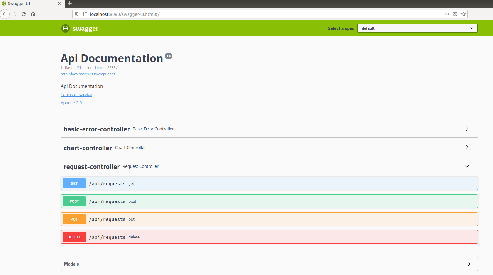
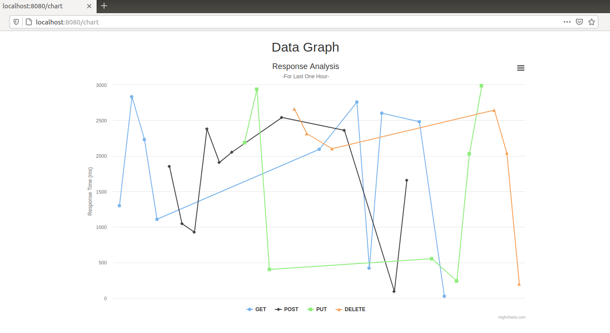

# Request Handler REST Service

This project is a simple Request Handler which is implemented by using Spring Boot, MySQL, Kafka, Docker. The service takes the requests, creates a response for each request. It writes these responses to the log file. Kafka catches these responses and saves them to the database.

Actually, this project is implemented to solve an encrypted task given by a company called Kartaca. The encrypted task and the code to solve it is in the "find-encrypted-task" folder. This is the key given in that encrypted task:

gAAAAABgUKS6mjATHzhvdaPv8lLnqzLstSCU1yMZ4BgYstTn33IP0qkANTe0YwuTRc2bMcsGUEO7aljiD6O3yDB2cP-9owerCkQv75tyb_JRIEs-Z5SgMaCZ407hHYzrkPn6Z4GHChbXGpYFGG6fo-RZhCcR_qubWdhmYD80jil3bzP4a4Q4QYH2ViKNlV_lR-GzoYPBSo6e

## Requirements

Docker

## How to Run the Application

* After clone the repository, go to the "dockerized-app" folder and open terminal.
* Type "docker-compose up" in order to run the aplication.
* Go to http://localhost:8080/swagger-ui.html to send GET, PUT, POST, DELETE requests by using Swagger UI.
* Go to http://localhost:8080/chart to see the chart of responses sent in the last one hours.

P.S.: "docker-compose up" can take a while. 

## Example Screenshots of Swagger UI and Chart pages

